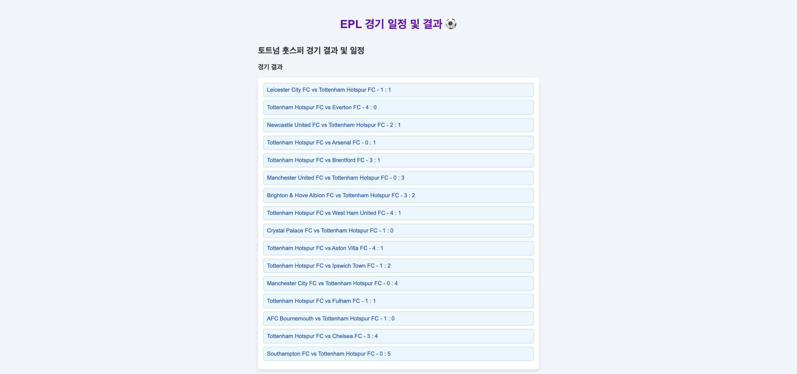

#  EPL Match Tracker

##  Project Overview

EPL Match Tracker is a web application designed for Premier League fans to check match schedules and results in real-time.  
It leverages the [Football-Data.org](https://www.football-data.org/) API to provide live updates and presents information through a user-friendly interface with dynamic visualizations.

---

##  Key Features

1. **Home Page**
   - Header text: "EPL Match Schedule & Results ⚽"
   - "Choose Club" button redirects users to the team selection page

2. **Team Selection Page**
   - Displays logos of all EPL clubs
   - Clicking on a team logo navigates to that team's match page
   - A "Back" button allows returning to the home page

3. **Match Schedule & Results Page**
   - Shows recent match results
   - Upcoming fixtures are displayed in a calendar view
   - Includes a "Back to Team Selection" button

4. **AJAX & Fetch API**
   - Enables real-time updates and asynchronous data fetching from the API

5. **League Standings Chart**
   - Uses `Chart.js` to display EPL standings as a line chart
   - Relegation zone teams are highlighted in red

6. **Web Storage (Local Storage)**
   - Remembers the user’s selected team and automatically redirects on revisit

---

## Wireframes

### Home Page  

###  Team Selection Page  

###  Match Schedule & Results Page  
  

---

##  Technologies Used

###  Frontend  

###  Backend  

### API  

### Libraries  

---

## Languages

---

##  Author

- **GaEun Lee**  
- Department of AI Engineering, Sookmyung Women’s University  
- GitHub: [2eueu](https://github.com/2eueu)

---

##  License

MIT License © 2024 GaEun Lee (2eueu_)
